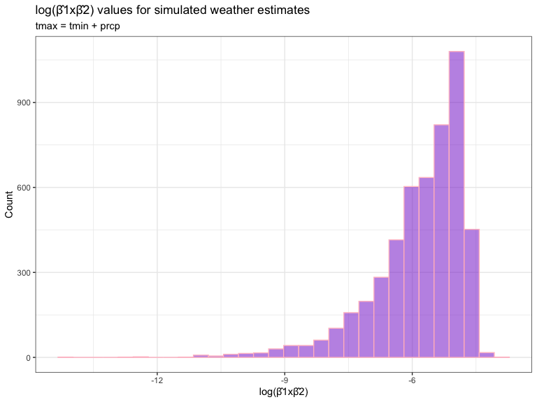

p8105_hw6
================
Carolyn Fish (csf2135)

#### Problem 1

Cleaning the homicide data set.

``` r
homicide_df = 
  read_csv("homicide-data.csv", 
           na = c("", "NA", "Unknown"), 
            col_types = cols(
                         victim_age = col_double()
                       ))  |> 
  mutate(
    city_state = str_c(city, state, sep = ", "),
    resolution = case_when(
      disposition == "Closed without arrest" ~ "unsolved",
      disposition == "Open/No arrest"        ~ "unsolved",
      disposition == "Closed by arrest"      ~ "solved"
    )
  ) |> 
filter(
  !(city_state %in% c("Tulsa, AL", "Dallas, TX", "Phoenix, AZ", "Kansas City, MO")),
  victim_race %in% c("Black", "White")
)
```

**Describe the raw data.**: The raw data includes variables for the
victim’s first and last name, demographic information (sex, race, age).
Each homicide has a unique identifier (`uid`) and the date the incident
was reported, the incident location (city, state, latitude, longitude),
and case status (`disposition`) are provided.

There are 39693 observations in the data and 14 variables in the raw
data set. Most data is non-missing, except for 42 instances where
latitude/longitude data is missing. There are 39693 unique incidents
described in the data occurring in 47 unique cities across the US.

Logistic regression with case resolution as outcome.

``` r
# Recode outcome = unsolved (0), and outcome = solved (1)
# Recode race = white as reference (0), and race = black (1)
# Recode sex = female as reference (0), and sex = male (1)

homicide_df = homicide_df |> 
  filter(
    !is.na(victim_sex) & !is.na(victim_age) & !is.na(victim_race) & !is.na(resolution)
  ) |> 
  mutate(
    outcome = case_match(
      resolution, 
     "solved" ~ 1, 
     "unsolved" ~ 0 
    ), 
    race = case_match(
      victim_race, 
      "Black" ~ 1, 
      "White" ~ 0
    ), 
    sex = case_match(
      victim_sex, 
      "Female" ~ 0, 
      "Male" ~ 1
    )) |> 
  select(
    city_state, outcome, race, sex, victim_age
  )
```

``` r
# fit logistic regression for resolution in Baltimore, MD
fit = glm(outcome ~ victim_age + sex + race, data = homicide_df |> filter(city_state == "Baltimore, MD") , 
          family = "binomial")

#create table of terms with confidence intervals
tidy_summary = broom::tidy(fit)

conf_intervals = confint(fit)

result_baltimore = cbind(tidy_summary, conf_intervals) 

result_baltimore |> 
  mutate(
    adj_OR = exp(estimate), 
    `lower 95% CI` = exp(`2.5 %`), 
    `upper 95% CI` = exp(`97.5 %`),
  ) |> 
  select(
    adj_OR, `lower 95% CI`, `upper 95% CI`
  ) |> 
  kableExtra::kable(digits = 2 )
```

<table>
<thead>
<tr>
<th style="text-align:left;">
</th>
<th style="text-align:right;">
adj_OR
</th>
<th style="text-align:right;">
lower 95% CI
</th>
<th style="text-align:right;">
upper 95% CI
</th>
</tr>
</thead>
<tbody>
<tr>
<td style="text-align:left;">
(Intercept)
</td>
<td style="text-align:right;">
3.16
</td>
<td style="text-align:right;">
2.00
</td>
<td style="text-align:right;">
5.06
</td>
</tr>
<tr>
<td style="text-align:left;">
victim_age
</td>
<td style="text-align:right;">
0.99
</td>
<td style="text-align:right;">
0.99
</td>
<td style="text-align:right;">
1.00
</td>
</tr>
<tr>
<td style="text-align:left;">
sex
</td>
<td style="text-align:right;">
0.43
</td>
<td style="text-align:right;">
0.32
</td>
<td style="text-align:right;">
0.56
</td>
</tr>
<tr>
<td style="text-align:left;">
race
</td>
<td style="text-align:right;">
0.43
</td>
<td style="text-align:right;">
0.31
</td>
<td style="text-align:right;">
0.61
</td>
</tr>
</tbody>
</table>

**Interpretation:** The odds of a homicide case in Baltimore, MD being
solved when victims were male is 0.43 times that of cases where victims
were female, adjusting for the victim’s age and race. At the 95% level
of significance, a range of reasonable estimates for the odds ratio are
between 0.32 and 0.56. The null hypothesis of an adjusted OR of 1 can be
rejected.

``` r
# create a new function to calculate adjusted OR and 95% CI
fit_and_extract <- function(df) {
  fit = glm(outcome ~ victim_age + sex + race, data = df, family = "binomial")
  
  tidy_summary = broom::tidy(fit)
  
  conf_intervals = confint(fit)
  
  result = cbind(tidy_summary, conf_intervals)
  
  result  |> 
    filter(term == "sex") |> 
    mutate(
      adj_OR = exp(estimate),
      `lower 95% CI` = exp(`2.5 %`),
      `upper 95% CI` = exp(`97.5 %`)
    )  |> 
    select(adj_OR, `lower 95% CI`, `upper 95% CI`)
}
```

``` r
results_all = homicide_df |> 
  group_by(city_state) |> 
  nest(data = c(outcome, victim_age, sex, race)) |> 
  mutate(
    results = purrr::map(data, fit_and_extract)
  ) |> 
  unnest(results) |> 
  mutate(city_state = fct_reorder(city_state, adj_OR))
```

Plot that shows the estimated ORs and CIs for each city.

``` r
plot_unsolved_sex = results_all  |> 
    arrange(adj_OR) |> 
  ggplot(aes(x = reorder(city_state, adj_OR), y = adj_OR, color = adj_OR)) +
    geom_point(size = 2) +
    scale_color_viridis_c(option = "turbo") +
    geom_errorbar(aes(ymin = `lower 95% CI`, ymax = `upper 95% CI`), size = 1, width = 0.2, alpha = 0.5) +
    labs(title = "Adjusted OR solved homicides by sex, by city", x = "City", y = "OR for Solved Homicides for male victims compared to females") +
    coord_flip() + 
    theme(
      panel.background = element_rect(fill = "grey95"), 
      axis.title = element_text(color = "black", size = 14), 
      axis.text = element_text(color = "black", size = 11), 
      title = element_text(color = "black", size = 18)
    ) +
  theme_bw()

plot_unsolved_sex
```


``` r
plot_save_path = "hw6_plots/OR_unsolved_sex_by_state.png"

ggsave(plot_save_path, plot_unsolved_sex, device = "png", width = 8, height = 9, units = "in", dpi = 300)
```

#### Problem 2

``` r
weather_df = 
  rnoaa::meteo_pull_monitors(
    c("USW00094728"),
    var = c("PRCP", "TMIN", "TMAX"), 
    date_min = "2022-01-01",
    date_max = "2022-12-31") |>
  mutate(
    name = recode(id, USW00094728 = "CentralPark_NY"),
    tmin = tmin / 10,
    tmax = tmax / 10) |>
  select(name, id, everything())
```

We’ll focus on a simple linear regression with `tmax` as the response
with `tmin` and `prcp` as the predictors, and are interested in the
distribution of two quantities estimated from these data: \* r̂2 \*
log(β̂1∗β̂2)

- Use 5000 bootstrap samples and,
- for each bootstrap sample, produce estimates of these two quantities.

``` r
set.seed(123)

sim_estimates = weather_df |> 
   filter(!is.na(tmax) & !is.na(tmin) & !is.na(prcp)) |> 
  select(tmax, tmin, prcp
  ) |> 
  modelr::bootstrap(n = 5000) |>
  mutate(
    models = map(strap, \(df) lm(tmax ~ tmin + prcp, data = df)),
    rsquared = map(models, ~ summary(.x)$r.squared), 
    beta_product = map(models, ~ (coef(.x)["tmin"] * coef(.x)["prcp"]))
  ) |> 
    unnest(c(rsquared, beta_product)) |>
  mutate(
     logbeta = log(abs(beta_product)) 
     )|>
  select(.id, rsquared, beta_product, logbeta) 
```

- Plot the distribution of your estimates, and describe these in words.

``` r
plot_sim_estimates_r2 = sim_estimates  |> 
  ggplot(aes(x = rsquared)) +
    geom_histogram(fill = "orange", color = "green3" ,alpha = 0.5) +
  labs(title = "R-squared values for simulated weather estimates", 
       subtitle = "tmax = tmin + prcp", 
       y = "Count", x = "R-squared value") +
    theme(
      panel.background = element_rect(fill = "grey95"), 
      axis.title = element_text(color = "black", size = 14), 
      axis.text = element_text(color = "black", size = 11), 
      title = element_text(color = "black", size = 18)
    ) +
  theme_bw()

plot_sim_estimates_r2
```


``` r
plot_save_path <- "hw6_plots/plot_sim_estimates_r2.png"

ggsave(plot_save_path, plot_sim_estimates_r2, device = "png", width = 6, height = 6, units = "in", dpi = 300)
```

The estimated R-squared values for the simulated weather data are
approximately normal. The median of the data is at 0.92.

``` r
plot_sim_estimates_log = sim_estimates  |> 
  ggplot(aes(x = logbeta)) +
    geom_histogram(fill = "purple3", color = "pink" ,alpha = 0.5) +
  labs(title = "log(β̂1xβ̂2) values for simulated weather estimates", 
       subtitle = "tmax = tmin + prcp", 
       y = "Count", x = "log(β̂1xβ̂2)") +
    theme(
      panel.background = element_rect(fill = "grey95"), 
      axis.title = element_text(color = "black", size = 14), 
      axis.text = element_text(color = "black", size = 11), 
      title = element_text(color = "black", size = 18)
    ) +
  theme_bw()

plot_sim_estimates_log
```



``` r
plot_save_path <- "hw6_plots/plot_sim_estimates_log2.png"

ggsave(plot_save_path, plot_sim_estimates_log, device = "png", width = 6, height = 6, units = "in", dpi = 300)
```

The estimated R-squared values for the simulated weather data have a
left skew. The median of the data is at -5.56.

- Using the 5000 bootstrap estimates, identify the 2.5% and 97.5%
  quantiles to provide a 95% confidence interval for r̂2 and log(β̂1∗β̂2).

``` r
sim_weather_cis = sim_estimates |> 
  summarise(
    rsquared_lower = quantile(rsquared, 0.025, na.rm = TRUE),
    rsquared_upper = quantile(rsquared, 0.975, na.rm = TRUE), 
    logbeta_lower = quantile(logbeta, 0.0275, na.rm = TRUE), 
    logbeta_upper = quantile(logbeta, 0.975, na.rm = TRUE)
  ) 


kableExtra::kable(sim_weather_cis, digits = 2)
```

<table>
<thead>
<tr>
<th style="text-align:right;">
rsquared_lower
</th>
<th style="text-align:right;">
rsquared_upper
</th>
<th style="text-align:right;">
logbeta_lower
</th>
<th style="text-align:right;">
logbeta_upper
</th>
</tr>
</thead>
<tbody>
<tr>
<td style="text-align:right;">
0.89
</td>
<td style="text-align:right;">
0.94
</td>
<td style="text-align:right;">
-8.63
</td>
<td style="text-align:right;">
-4.6
</td>
</tr>
</tbody>
</table>

The 95% CI for R-square values for the relationship between tmax and
tmin + prcp is: (0.89 - 0.94).

The 95% CI for the log(β̂1∗β2) is: (-8.63 - -4.6).

#### Problem 3

- Load and clean the data for regression analysis (i.e. convert numeric
  to factor where appropriate, check for missing data, etc.).

<table style="width: auto;" class="table table-condensed">
<caption>
Data summary
</caption>
<tbody>
<tr>
<td style="text-align:left;">
Name
</td>
<td style="text-align:left;">
df_birthweight
</td>
</tr>
<tr>
<td style="text-align:left;">
Number of rows
</td>
<td style="text-align:left;">
4342
</td>
</tr>
<tr>
<td style="text-align:left;">
Number of columns
</td>
<td style="text-align:left;">
20
</td>
</tr>
<tr>
<td style="text-align:left;">
\_\_\_\_\_\_\_\_\_\_\_\_\_\_\_\_\_\_\_\_\_\_\_
</td>
<td style="text-align:left;">
</td>
</tr>
<tr>
<td style="text-align:left;">
Column type frequency:
</td>
<td style="text-align:left;">
</td>
</tr>
<tr>
<td style="text-align:left;">
numeric
</td>
<td style="text-align:left;">
20
</td>
</tr>
<tr>
<td style="text-align:left;">
\_\_\_\_\_\_\_\_\_\_\_\_\_\_\_\_\_\_\_\_\_\_\_\_
</td>
<td style="text-align:left;">
</td>
</tr>
<tr>
<td style="text-align:left;">
Group variables
</td>
<td style="text-align:left;">
None
</td>
</tr>
</tbody>
</table>

**Variable type: numeric**

<table>
<thead>
<tr>
<th style="text-align:left;">
skim_variable
</th>
<th style="text-align:right;">
n_missing
</th>
<th style="text-align:right;">
complete_rate
</th>
<th style="text-align:right;">
mean
</th>
<th style="text-align:right;">
sd
</th>
<th style="text-align:right;">
p0
</th>
<th style="text-align:right;">
p25
</th>
<th style="text-align:right;">
p50
</th>
<th style="text-align:right;">
p75
</th>
<th style="text-align:right;">
p100
</th>
<th style="text-align:left;">
hist
</th>
</tr>
</thead>
<tbody>
<tr>
<td style="text-align:left;">
babysex
</td>
<td style="text-align:right;">
0
</td>
<td style="text-align:right;">
1
</td>
<td style="text-align:right;">
1.49
</td>
<td style="text-align:right;">
0.50
</td>
<td style="text-align:right;">
1.00
</td>
<td style="text-align:right;">
1.00
</td>
<td style="text-align:right;">
1.00
</td>
<td style="text-align:right;">
2.00
</td>
<td style="text-align:right;">
2.0
</td>
<td style="text-align:left;">
▇▁▁▁▇
</td>
</tr>
<tr>
<td style="text-align:left;">
bhead
</td>
<td style="text-align:right;">
0
</td>
<td style="text-align:right;">
1
</td>
<td style="text-align:right;">
33.65
</td>
<td style="text-align:right;">
1.62
</td>
<td style="text-align:right;">
21.00
</td>
<td style="text-align:right;">
33.00
</td>
<td style="text-align:right;">
34.00
</td>
<td style="text-align:right;">
35.00
</td>
<td style="text-align:right;">
41.0
</td>
<td style="text-align:left;">
▁▁▆▇▁
</td>
</tr>
<tr>
<td style="text-align:left;">
blength
</td>
<td style="text-align:right;">
0
</td>
<td style="text-align:right;">
1
</td>
<td style="text-align:right;">
49.75
</td>
<td style="text-align:right;">
2.72
</td>
<td style="text-align:right;">
20.00
</td>
<td style="text-align:right;">
48.00
</td>
<td style="text-align:right;">
50.00
</td>
<td style="text-align:right;">
51.00
</td>
<td style="text-align:right;">
63.0
</td>
<td style="text-align:left;">
▁▁▁▇▁
</td>
</tr>
<tr>
<td style="text-align:left;">
bwt
</td>
<td style="text-align:right;">
0
</td>
<td style="text-align:right;">
1
</td>
<td style="text-align:right;">
3114.40
</td>
<td style="text-align:right;">
512.15
</td>
<td style="text-align:right;">
595.00
</td>
<td style="text-align:right;">
2807.00
</td>
<td style="text-align:right;">
3132.50
</td>
<td style="text-align:right;">
3459.00
</td>
<td style="text-align:right;">
4791.0
</td>
<td style="text-align:left;">
▁▁▇▇▁
</td>
</tr>
<tr>
<td style="text-align:left;">
delwt
</td>
<td style="text-align:right;">
0
</td>
<td style="text-align:right;">
1
</td>
<td style="text-align:right;">
145.57
</td>
<td style="text-align:right;">
22.21
</td>
<td style="text-align:right;">
86.00
</td>
<td style="text-align:right;">
131.00
</td>
<td style="text-align:right;">
143.00
</td>
<td style="text-align:right;">
157.00
</td>
<td style="text-align:right;">
334.0
</td>
<td style="text-align:left;">
▅▇▁▁▁
</td>
</tr>
<tr>
<td style="text-align:left;">
fincome
</td>
<td style="text-align:right;">
0
</td>
<td style="text-align:right;">
1
</td>
<td style="text-align:right;">
44.11
</td>
<td style="text-align:right;">
25.98
</td>
<td style="text-align:right;">
0.00
</td>
<td style="text-align:right;">
25.00
</td>
<td style="text-align:right;">
35.00
</td>
<td style="text-align:right;">
65.00
</td>
<td style="text-align:right;">
96.0
</td>
<td style="text-align:left;">
▃▇▅▂▃
</td>
</tr>
<tr>
<td style="text-align:left;">
frace
</td>
<td style="text-align:right;">
0
</td>
<td style="text-align:right;">
1
</td>
<td style="text-align:right;">
1.66
</td>
<td style="text-align:right;">
0.85
</td>
<td style="text-align:right;">
1.00
</td>
<td style="text-align:right;">
1.00
</td>
<td style="text-align:right;">
2.00
</td>
<td style="text-align:right;">
2.00
</td>
<td style="text-align:right;">
8.0
</td>
<td style="text-align:left;">
▇▁▁▁▁
</td>
</tr>
<tr>
<td style="text-align:left;">
gaweeks
</td>
<td style="text-align:right;">
0
</td>
<td style="text-align:right;">
1
</td>
<td style="text-align:right;">
39.43
</td>
<td style="text-align:right;">
3.15
</td>
<td style="text-align:right;">
17.70
</td>
<td style="text-align:right;">
38.30
</td>
<td style="text-align:right;">
39.90
</td>
<td style="text-align:right;">
41.10
</td>
<td style="text-align:right;">
51.3
</td>
<td style="text-align:left;">
▁▁▂▇▁
</td>
</tr>
<tr>
<td style="text-align:left;">
malform
</td>
<td style="text-align:right;">
0
</td>
<td style="text-align:right;">
1
</td>
<td style="text-align:right;">
0.00
</td>
<td style="text-align:right;">
0.06
</td>
<td style="text-align:right;">
0.00
</td>
<td style="text-align:right;">
0.00
</td>
<td style="text-align:right;">
0.00
</td>
<td style="text-align:right;">
0.00
</td>
<td style="text-align:right;">
1.0
</td>
<td style="text-align:left;">
▇▁▁▁▁
</td>
</tr>
<tr>
<td style="text-align:left;">
menarche
</td>
<td style="text-align:right;">
0
</td>
<td style="text-align:right;">
1
</td>
<td style="text-align:right;">
12.51
</td>
<td style="text-align:right;">
1.48
</td>
<td style="text-align:right;">
0.00
</td>
<td style="text-align:right;">
12.00
</td>
<td style="text-align:right;">
12.00
</td>
<td style="text-align:right;">
13.00
</td>
<td style="text-align:right;">
19.0
</td>
<td style="text-align:left;">
▁▁▂▇▁
</td>
</tr>
<tr>
<td style="text-align:left;">
mheight
</td>
<td style="text-align:right;">
0
</td>
<td style="text-align:right;">
1
</td>
<td style="text-align:right;">
63.49
</td>
<td style="text-align:right;">
2.66
</td>
<td style="text-align:right;">
48.00
</td>
<td style="text-align:right;">
62.00
</td>
<td style="text-align:right;">
63.00
</td>
<td style="text-align:right;">
65.00
</td>
<td style="text-align:right;">
77.0
</td>
<td style="text-align:left;">
▁▁▇▂▁
</td>
</tr>
<tr>
<td style="text-align:left;">
momage
</td>
<td style="text-align:right;">
0
</td>
<td style="text-align:right;">
1
</td>
<td style="text-align:right;">
20.30
</td>
<td style="text-align:right;">
3.88
</td>
<td style="text-align:right;">
12.00
</td>
<td style="text-align:right;">
18.00
</td>
<td style="text-align:right;">
20.00
</td>
<td style="text-align:right;">
22.00
</td>
<td style="text-align:right;">
44.0
</td>
<td style="text-align:left;">
▅▇▂▁▁
</td>
</tr>
<tr>
<td style="text-align:left;">
mrace
</td>
<td style="text-align:right;">
0
</td>
<td style="text-align:right;">
1
</td>
<td style="text-align:right;">
1.63
</td>
<td style="text-align:right;">
0.77
</td>
<td style="text-align:right;">
1.00
</td>
<td style="text-align:right;">
1.00
</td>
<td style="text-align:right;">
2.00
</td>
<td style="text-align:right;">
2.00
</td>
<td style="text-align:right;">
4.0
</td>
<td style="text-align:left;">
▇▇▁▁▁
</td>
</tr>
<tr>
<td style="text-align:left;">
parity
</td>
<td style="text-align:right;">
0
</td>
<td style="text-align:right;">
1
</td>
<td style="text-align:right;">
0.00
</td>
<td style="text-align:right;">
0.10
</td>
<td style="text-align:right;">
0.00
</td>
<td style="text-align:right;">
0.00
</td>
<td style="text-align:right;">
0.00
</td>
<td style="text-align:right;">
0.00
</td>
<td style="text-align:right;">
6.0
</td>
<td style="text-align:left;">
▇▁▁▁▁
</td>
</tr>
<tr>
<td style="text-align:left;">
pnumlbw
</td>
<td style="text-align:right;">
0
</td>
<td style="text-align:right;">
1
</td>
<td style="text-align:right;">
0.00
</td>
<td style="text-align:right;">
0.00
</td>
<td style="text-align:right;">
0.00
</td>
<td style="text-align:right;">
0.00
</td>
<td style="text-align:right;">
0.00
</td>
<td style="text-align:right;">
0.00
</td>
<td style="text-align:right;">
0.0
</td>
<td style="text-align:left;">
▁▁▇▁▁
</td>
</tr>
<tr>
<td style="text-align:left;">
pnumsga
</td>
<td style="text-align:right;">
0
</td>
<td style="text-align:right;">
1
</td>
<td style="text-align:right;">
0.00
</td>
<td style="text-align:right;">
0.00
</td>
<td style="text-align:right;">
0.00
</td>
<td style="text-align:right;">
0.00
</td>
<td style="text-align:right;">
0.00
</td>
<td style="text-align:right;">
0.00
</td>
<td style="text-align:right;">
0.0
</td>
<td style="text-align:left;">
▁▁▇▁▁
</td>
</tr>
<tr>
<td style="text-align:left;">
ppbmi
</td>
<td style="text-align:right;">
0
</td>
<td style="text-align:right;">
1
</td>
<td style="text-align:right;">
21.57
</td>
<td style="text-align:right;">
3.18
</td>
<td style="text-align:right;">
13.07
</td>
<td style="text-align:right;">
19.53
</td>
<td style="text-align:right;">
21.03
</td>
<td style="text-align:right;">
22.91
</td>
<td style="text-align:right;">
46.1
</td>
<td style="text-align:left;">
▃▇▁▁▁
</td>
</tr>
<tr>
<td style="text-align:left;">
ppwt
</td>
<td style="text-align:right;">
0
</td>
<td style="text-align:right;">
1
</td>
<td style="text-align:right;">
123.49
</td>
<td style="text-align:right;">
20.16
</td>
<td style="text-align:right;">
70.00
</td>
<td style="text-align:right;">
110.00
</td>
<td style="text-align:right;">
120.00
</td>
<td style="text-align:right;">
134.00
</td>
<td style="text-align:right;">
287.0
</td>
<td style="text-align:left;">
▅▇▁▁▁
</td>
</tr>
<tr>
<td style="text-align:left;">
smoken
</td>
<td style="text-align:right;">
0
</td>
<td style="text-align:right;">
1
</td>
<td style="text-align:right;">
4.15
</td>
<td style="text-align:right;">
7.41
</td>
<td style="text-align:right;">
0.00
</td>
<td style="text-align:right;">
0.00
</td>
<td style="text-align:right;">
0.00
</td>
<td style="text-align:right;">
5.00
</td>
<td style="text-align:right;">
60.0
</td>
<td style="text-align:left;">
▇▁▁▁▁
</td>
</tr>
<tr>
<td style="text-align:left;">
wtgain
</td>
<td style="text-align:right;">
0
</td>
<td style="text-align:right;">
1
</td>
<td style="text-align:right;">
22.08
</td>
<td style="text-align:right;">
10.94
</td>
<td style="text-align:right;">
-46.00
</td>
<td style="text-align:right;">
15.00
</td>
<td style="text-align:right;">
22.00
</td>
<td style="text-align:right;">
28.00
</td>
<td style="text-align:right;">
89.0
</td>
<td style="text-align:left;">
▁▁▇▁▁
</td>
</tr>
</tbody>
</table>

The `birthweight.csv` dataset contains 4342 observations and 20
variables describing various potential predictors for birthweight
(`bwt`), including mother’s weight gain during pregnancy (`wtgain`),
maternal smoking exposure (`smoken`), mother’s age at birth (`momage`),
gestational age in weeks (`gaweeks`), maternal (`mrace`) and paternal
(`frace`) race, and family income (`fincome`).

The dataset has no missing data and all variables in the original data
are numeric.

**I propose a regression model to see how much variability in
birthweight can be attributed to the mother’s weight gain during the
pregnancy, adjusting for mom’s smoking exposure, age at birth,
gestational age, race, dad’s race, and family income. I hypothesize that
less maternal weight gain, or maternal weight loss, during pregnancy
will be associated with lower birthweight.**

The first step in my model building process is to establish reference
variables and check the distributions of variables. Upon looking at the
distributions of race for moms and dads, some of the cell sizes get
pretty small for the Asian, Puerto Rican, and Other racial categories. I
decided to combine these for the sake of building the model because I am
unaware of any literature-based reason not to (not saying it’s the best
choice). Then I adjusted for this re-categorization in the analytic data
set. I also made unordered categorical variables (`mrace`) into factors.

``` r
#checking distributions for continuous variables

df_birthweight |> 
  select(
    bwt, wtgain, smoken, momage, gaweeks, fincome
  ) |> 
  gather(variable, value) |> 
ggplot(aes(x = value, fill = variable)) +
  geom_histogram(binwidth = 5, position = "identity", alpha = 0.7) +
  facet_grid(~variable, scales = "free") +
  theme_minimal() +
  theme(legend.position = "None")
```


``` r
# checking racial distribution 

df_birthweight |> 
  select(mrace) |> 
  mutate(
    `Mom's Race` = case_match(
      as.numeric(mrace),
      1 ~ "White",
      2 ~ "Black",
      3 ~ "Asian",
      4 ~ "Puerto Rican",
      8 ~ "Other",
      9 ~ "Unknown"
    )
  ) |> 
  count(`Mom's Race`) |> 
  pivot_wider(names_from = `Mom's Race`, values_from = n) |>
  kableExtra::kable()
```

<table>
<thead>
<tr>
<th style="text-align:right;">
Asian
</th>
<th style="text-align:right;">
Black
</th>
<th style="text-align:right;">
Puerto Rican
</th>
<th style="text-align:right;">
White
</th>
</tr>
</thead>
<tbody>
<tr>
<td style="text-align:right;">
43
</td>
<td style="text-align:right;">
1909
</td>
<td style="text-align:right;">
243
</td>
<td style="text-align:right;">
2147
</td>
</tr>
</tbody>
</table>

``` r
 df_birthweight |> 
  select(mrace) |> 
  mutate(
    `Mom's Race` = case_match(
      as.numeric(mrace),
      1 ~ "White",
      2 ~ "Black",
      3 ~ "Other",
      4 ~ "Other",
      8 ~ "Other",
      9 ~ "Unknown"
    )
  ) |>  
  count(`Mom's Race`) |> 
  pivot_wider(names_from = `Mom's Race`, values_from = n) |> 
  kableExtra::kable()
```

<table>
<thead>
<tr>
<th style="text-align:right;">
Black
</th>
<th style="text-align:right;">
Other
</th>
<th style="text-align:right;">
White
</th>
</tr>
</thead>
<tbody>
<tr>
<td style="text-align:right;">
1909
</td>
<td style="text-align:right;">
286
</td>
<td style="text-align:right;">
2147
</td>
</tr>
</tbody>
</table>

``` r
df_birthweight_analytic = df_birthweight |> 
  mutate(
    mrace = case_match(
      as.numeric(mrace),
      1 ~ "White",
      2 ~ "Black",
      3 ~ "Other",
      4 ~ "Other",
      8 ~ "Other",
      9 ~ "Unknown"
    )
  ) |>  
  mutate(
    mrace = fct_infreq(mrace)
  )
```

Fit full model and tidy the output

``` r
fit = lm(bwt ~ wtgain + smoken + momage + gaweeks + mrace + fincome, data = df_birthweight_analytic)

fit |> 
  broom::glance() |> 
  kableExtra::kable(digits = 3)
```

<table>
<thead>
<tr>
<th style="text-align:right;">
r.squared
</th>
<th style="text-align:right;">
adj.r.squared
</th>
<th style="text-align:right;">
sigma
</th>
<th style="text-align:right;">
statistic
</th>
<th style="text-align:right;">
p.value
</th>
<th style="text-align:right;">
df
</th>
<th style="text-align:right;">
logLik
</th>
<th style="text-align:right;">
AIC
</th>
<th style="text-align:right;">
BIC
</th>
<th style="text-align:right;">
deviance
</th>
<th style="text-align:right;">
df.residual
</th>
<th style="text-align:right;">
nobs
</th>
</tr>
</thead>
<tbody>
<tr>
<td style="text-align:right;">
0.284
</td>
<td style="text-align:right;">
0.283
</td>
<td style="text-align:right;">
433.633
</td>
<td style="text-align:right;">
245.92
</td>
<td style="text-align:right;">
0
</td>
<td style="text-align:right;">
7
</td>
<td style="text-align:right;">
-32522.52
</td>
<td style="text-align:right;">
65063.03
</td>
<td style="text-align:right;">
65120.42
</td>
<td style="text-align:right;">
814956203
</td>
<td style="text-align:right;">
4334
</td>
<td style="text-align:right;">
4342
</td>
</tr>
</tbody>
</table>

``` r
fit |> 
  broom::tidy() |> 
  mutate(term = 
           str_replace(term, "^mrace", "Mom's race: ")
         ) |> 
    kableExtra::kable(digits = 3)
```

<table>
<thead>
<tr>
<th style="text-align:left;">
term
</th>
<th style="text-align:right;">
estimate
</th>
<th style="text-align:right;">
std.error
</th>
<th style="text-align:right;">
statistic
</th>
<th style="text-align:right;">
p.value
</th>
</tr>
</thead>
<tbody>
<tr>
<td style="text-align:left;">
(Intercept)
</td>
<td style="text-align:right;">
827.780
</td>
<td style="text-align:right;">
92.562
</td>
<td style="text-align:right;">
8.943
</td>
<td style="text-align:right;">
0.000
</td>
</tr>
<tr>
<td style="text-align:left;">
wtgain
</td>
<td style="text-align:right;">
9.425
</td>
<td style="text-align:right;">
0.612
</td>
<td style="text-align:right;">
15.398
</td>
<td style="text-align:right;">
0.000
</td>
</tr>
<tr>
<td style="text-align:left;">
smoken
</td>
<td style="text-align:right;">
-11.188
</td>
<td style="text-align:right;">
0.920
</td>
<td style="text-align:right;">
-12.166
</td>
<td style="text-align:right;">
0.000
</td>
</tr>
<tr>
<td style="text-align:left;">
momage
</td>
<td style="text-align:right;">
4.501
</td>
<td style="text-align:right;">
1.865
</td>
<td style="text-align:right;">
2.413
</td>
<td style="text-align:right;">
0.016
</td>
</tr>
<tr>
<td style="text-align:left;">
gaweeks
</td>
<td style="text-align:right;">
54.354
</td>
<td style="text-align:right;">
2.153
</td>
<td style="text-align:right;">
25.245
</td>
<td style="text-align:right;">
0.000
</td>
</tr>
<tr>
<td style="text-align:left;">
Mom’s race: Black
</td>
<td style="text-align:right;">
-268.984
</td>
<td style="text-align:right;">
15.896
</td>
<td style="text-align:right;">
-16.922
</td>
<td style="text-align:right;">
0.000
</td>
</tr>
<tr>
<td style="text-align:left;">
Mom’s race: Other
</td>
<td style="text-align:right;">
-169.740
</td>
<td style="text-align:right;">
27.977
</td>
<td style="text-align:right;">
-6.067
</td>
<td style="text-align:right;">
0.000
</td>
</tr>
<tr>
<td style="text-align:left;">
fincome
</td>
<td style="text-align:right;">
0.453
</td>
<td style="text-align:right;">
0.283
</td>
<td style="text-align:right;">
1.598
</td>
<td style="text-align:right;">
0.110
</td>
</tr>
</tbody>
</table>

\*show a plot of model residuals against fitted values

``` r
df_birthweight_analytic |> 
    modelr::add_residuals(fit) |> 
    modelr::add_predictions(fit) |> 
  ggplot(aes(x = pred, y = resid)) + 
    geom_hline(yintercept= 0, color = "red", alpha = 0.5) +
    geom_point(color= "blue2", alpha= 0.2) + 
    labs(title = "Birthweight ~ weight gain predicted by residuals ", x = "Fitted values", y = "Residuals") +
    theme_bw()
```


There seems to be random scatter around Residual = 0 (red line) and no
obvious pattern or trend suggesting systemic issues or dependence. There
may be a few outliers for the lower fitted values, but for the purpose
of this assignment I will leave them in the data.

I assume that these confounders may have different impact on birthweight
~ maternal weight gain by how mom is racialized, so I will nest within
racial groups for race-specific estimates.

``` r
nest_lm_res =
  df_birthweight_analytic |> 
  nest(data = -mrace) |> 
  mutate(
    models = map(data, \(df) lm(bwt ~ wtgain + smoken + momage + gaweeks + fincome, data = df)),
    results = map(models, broom::tidy)) |> 
  select(-data, -models) |> 
  unnest(results)

nest_lm_res |> 
  select(mrace, term, estimate) |> 
  mutate(term = fct_inorder(term)) |> 
  pivot_wider(
    names_from = term, values_from = estimate) |> 
  knitr::kable(digits = 3)
```

<table>
<thead>
<tr>
<th style="text-align:left;">
mrace
</th>
<th style="text-align:right;">
(Intercept)
</th>
<th style="text-align:right;">
wtgain
</th>
<th style="text-align:right;">
smoken
</th>
<th style="text-align:right;">
momage
</th>
<th style="text-align:right;">
gaweeks
</th>
<th style="text-align:right;">
fincome
</th>
</tr>
</thead>
<tbody>
<tr>
<td style="text-align:left;">
White
</td>
<td style="text-align:right;">
194.798
</td>
<td style="text-align:right;">
8.167
</td>
<td style="text-align:right;">
-11.817
</td>
<td style="text-align:right;">
3.565
</td>
<td style="text-align:right;">
70.994
</td>
<td style="text-align:right;">
0.807
</td>
</tr>
<tr>
<td style="text-align:left;">
Black
</td>
<td style="text-align:right;">
862.475
</td>
<td style="text-align:right;">
11.029
</td>
<td style="text-align:right;">
-8.811
</td>
<td style="text-align:right;">
3.955
</td>
<td style="text-align:right;">
46.420
</td>
<td style="text-align:right;">
-0.329
</td>
</tr>
<tr>
<td style="text-align:left;">
Other
</td>
<td style="text-align:right;">
847.192
</td>
<td style="text-align:right;">
6.690
</td>
<td style="text-align:right;">
-7.315
</td>
<td style="text-align:right;">
6.049
</td>
<td style="text-align:right;">
50.083
</td>
<td style="text-align:right;">
0.280
</td>
</tr>
</tbody>
</table>

- Compare your model to two others:
  - One using length at birth and gestational age as predictors (main
    effects only)
  - One using head circumference, length, sex, and all interactions
    (including the three-way interaction) between these

Create training and testing data

``` r
cv_df = 
  modelr::crossv_mc(df_birthweight_analytic, 100) 

cv_df =
  cv_df |> 
  mutate(
    train = map(train, as_tibble),
    test = map(test, as_tibble)) 

cv_df = 
  cv_df |> 
  mutate(
    my_mod  = map(train, \(df)  lm(bwt ~ wtgain + smoken + momage + gaweeks + mrace + fincome, data = df)),
    one_mod  = map(train, \(df) lm(bwt ~ blength + gaweeks, data = df)),
    two_mod  = map(train, \(df) lm(bwt ~ bhead * blength * babysex, data = df))) |> 
  mutate(
    rmse_my_mod = map2_dbl(my_mod, test, \(mod, df) rmse(model = mod, data = df)),
    rmse_one_mod = map2_dbl(one_mod, test, \(mod, df) rmse(model = mod, data = df)),
    rmse_two_mod = map2_dbl(two_mod, test, \(mod, df) rmse(model = mod, data = df)))
```

``` r
cv_df |> 
  select(starts_with("rmse")) |> 
  pivot_longer(
    everything(),
    names_to = "model", 
    values_to = "rmse",
    names_prefix = "rmse_") |> 
  mutate(
    model = case_match(
      model, 
      "my_mod" ~ "My model", 
      "one_mod" ~ "Main effects", 
      "two_mod" ~ "Interactions"
    )
  ) |> 
  mutate(model = fct_inorder(model)) |> 
  ggplot(aes(x = model, y = rmse)) + 
    geom_violin(aes(fill = model), alpha = 0.5) + 
    ggtitle("Prediction error distribution for candidates models") +
    theme_bw() + 
    theme(legend.position = "bottom")
```


Comparing RMSE values for each of the models demonstrates that the model
containing the predictors head circumference, length, sex, and all
interactions of these three variables had the best fit relative to my
model and the other model provided for comparison. If I were to try to
refine my model I would definitely look into testing for potential
interactions and the incorportation of the variables used in the
“interactions” model.
